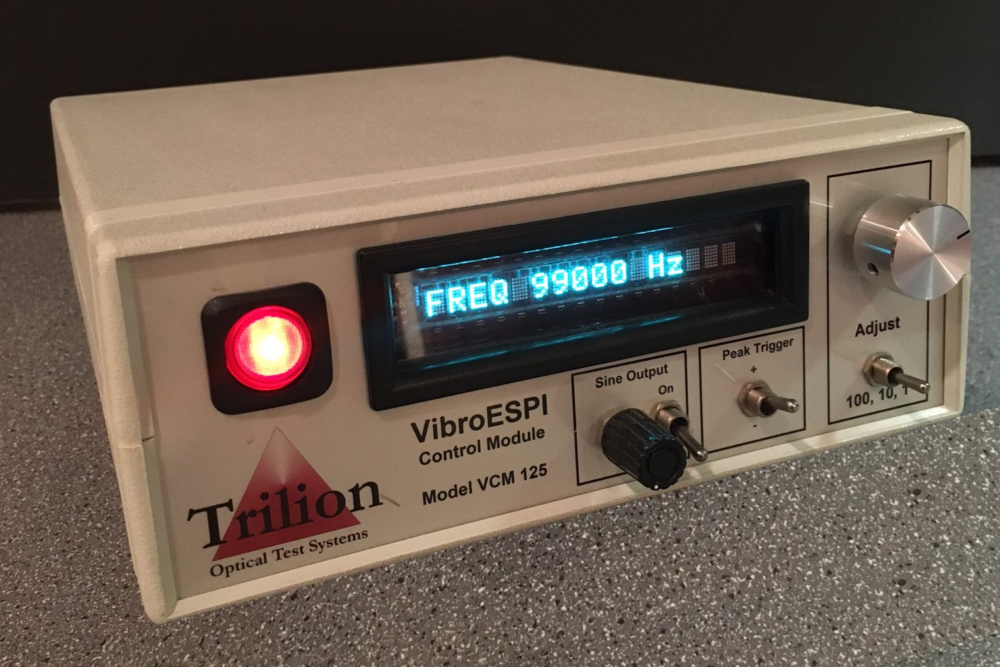
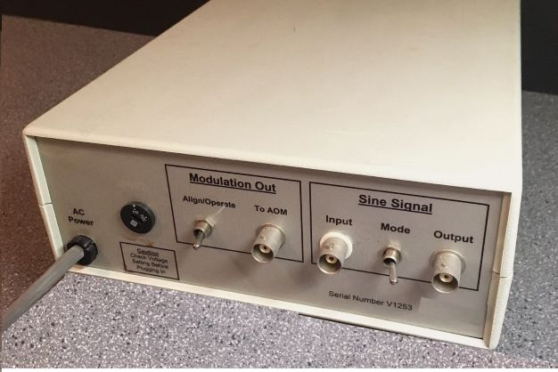

# Vibrometer-Control-Module
A triggering system for Q-switching of a pulsed laser.

# VIBROMETER CONTROL MODULE - LASER TRIGGERING SYSTEM - Q SWITCHING

The Vibrometer Control Module (VCM) is used to control an Acousto-Optic Modulator (AOM), which allows a pulsed laser illumination to be synchronized with a vibration source to perform laser holography (ESPI) vibrometry measurements.  The VCM outputs a digital pulse centered at the peak of the excitation signal.  The excitation can be an external source or an internally synthesized sine wave.  In addition, the pulse width and phase of the trigger signal is variable by digital adjustment.

The VCM can be used as a general purpose trigger for gating of high-voltage pulse generators, pulsers and laser diode drivers.

# Specifications:

Inputs

1.  Sine Wave +/-5V pk-pk
    Min:  100Hz
    Max:  99 KHz
    Resolution:  1Hz

Outputs

1.  Digitally sythesized sine wave +/-5V pk-pk
2.  Digital output for laser triggering.
